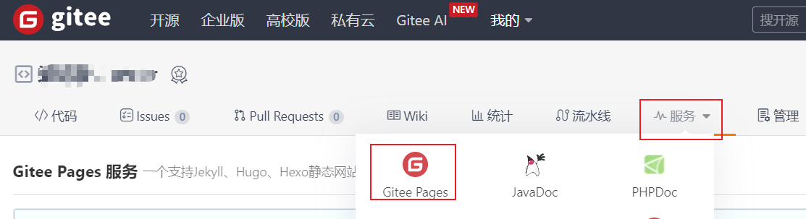
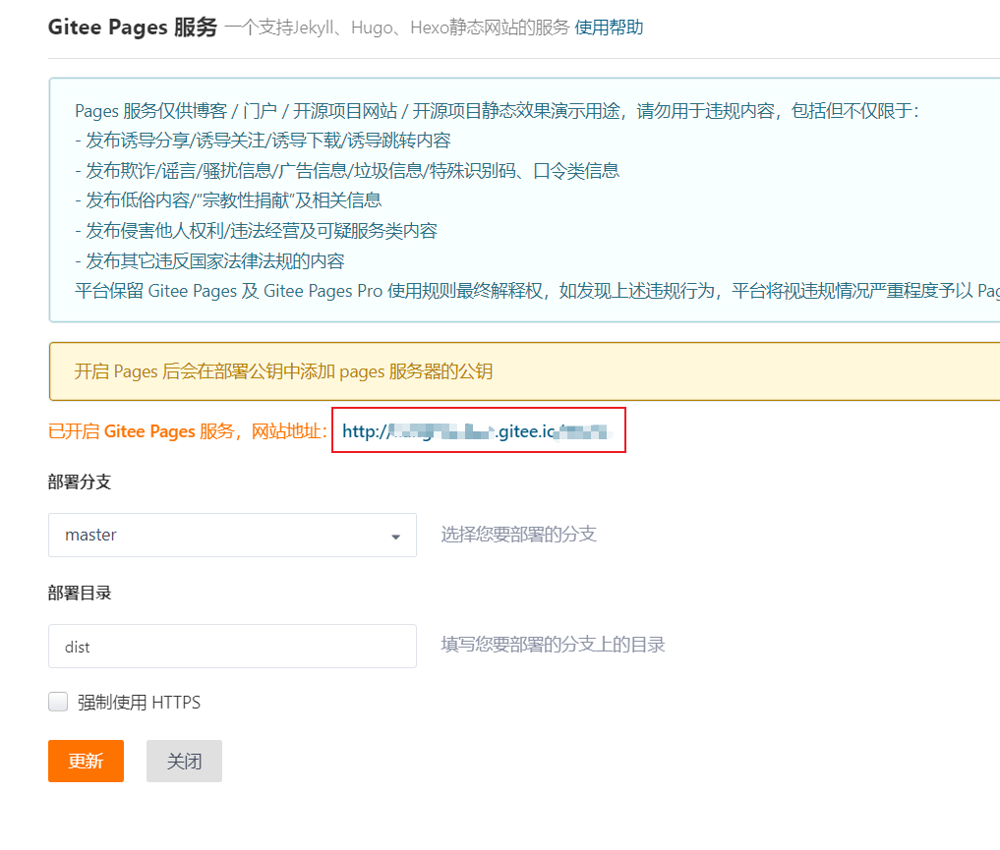

# 博客搭建介绍

### 静态网页建站无服务器方式介绍

##### 1. gitee pages

考虑到GitHub访问慢、需要各类手段等问题，我们使用gitee。gitee提供了免费的静态网站搭建功能，在个人项目中点击：服务。点击：Gitee Pages。

进入gitee pages

在gitee pages页面中，我们选择好项目分支，填写好部署目录（注意，**部署目录文件夹下要有index.html文件夹为入口**。我这里使用的是webpack打包后的dist文件为目录）。

进入gitee pages

gitee pages提供多样网站搭建服务，用户可以根据自身需求来制作。

##### 2. vue搭建项目介绍
暂时不想写了

