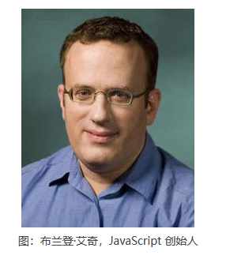

# 入门前端小建议

### 一、基础：前端三大件

1. HTML、CSS

   HTML：
   html是Web开发里最基础、重点要掌握的知识。1994年，万维网联盟（W3C，World Wide Web Consortium）成立，超文本标记语言（HTML，Hyper Text Markup Language）正式确立为网页标准语言。经过近10年变迁，于2014年，HTML已发展成HTML5标准并沿用至今。
   
   下面是最基础的HTML页面编写方式
   
   ```html
   <!DOCTYPE html>
   <html>
     <head>
       <meta charset="utf-8">
       <title>title</title>
     </head>
     <body>
     </body>
   </html>
   ```

   <center><font size="2" color="#CDCDCD">html代码片段</font></center>
   
   其中`<!DOCTYPE html> `声明为 HTML5 文档。
    `<html>` 元素是 HTML 页面的根元素。
    `<head>` 元素包含了文档的元（meta）数据，如`<meta charset="utf-8">`定义网页编码格式为 utf-8。
    `<title>` 元素描述了文档的标题。
    `<body>` 元素包含了可见的页面内容。
   
    虽然前端变迁大、更新换代速度快，但笔者仍建议初学者**打好html基础**。日后无论遇到什么框架，对DOM的操作、页面结构布局等内容会更加容易上手。
   
   这些是HTML推荐学习网站及书籍：

   [菜鸟教程](https://www.runoob.com/html/html-intro.html)
   
   `html5从入门到精通`第三版

   html上手简单，入门快，笔者建议初学者**直接编写代码**，结合CSS开发基础简单的网页以学习
   
   CSS：
   html好比是一辆车的骨架，那css则是这辆车的车衣、内饰布局。css与html要结合起来学才能学好，而css的天花板，更是无比的高。一个好看的过度动画或样式，需要不断实践修改才能得出。
   ```css
   <style type="text/css">
      .container{
        padding:0px;
      }
   </style>
   ```
  <center><font size="2" color="#CDCDCD">CSS代码片段</font></center>

2. JavaScript
  
   正如前面所说，如果html是车架，css是车衣内饰布局，那么JavaScript则是这辆车的中控。

   JavaScript掌控着前端web的逻辑处理和数据处理，是前端的灵魂，最重要学习的一门课程。JavaScript 最初被称为 LiveScript，由 Netscape（Netscape Communications Corporation，网景通信公司）公司的布兰登·艾奇（Brendan Eich）在 1995 年开发。在 Netscape 与 Sun（一家互联网公司，全称为“Sun Microsystems”，现已被甲骨文公司收购）合作。作为一种脚本语言，JavaScript 代码不能独立运行，通常情况下我们需要借助浏览器来运行 JavaScript 代码，所有 Web 浏览器都支持 JavaScript。
   

   JavaScript作为最重要的一门语言，希望初学者入门时要着重学习。在学习JavaScript前，可以先学习C语言、java和python这类开发语言，虽然本质不同，但其所需的逻辑能力相当。
   ```JavaScript
   <script type="text/javascript">
      alert(“Hello World!”);
   </script>
   ```
   <center><font size="2" color="#CDCDCD">js代码片段</font></center>

   这些是JavaScript推荐学习网站及书籍：

   [菜鸟教程](https://www.runoob.com/js/js-tutorial.html)
   
   `你不知道的JavaScript`全卷

   三大件是前端入门学习必备，掌握好这三种语言，往后前端开发会相对简单。

### 二、进阶：框架

### 三、深入：底层原理

### 四、飞仙：架构