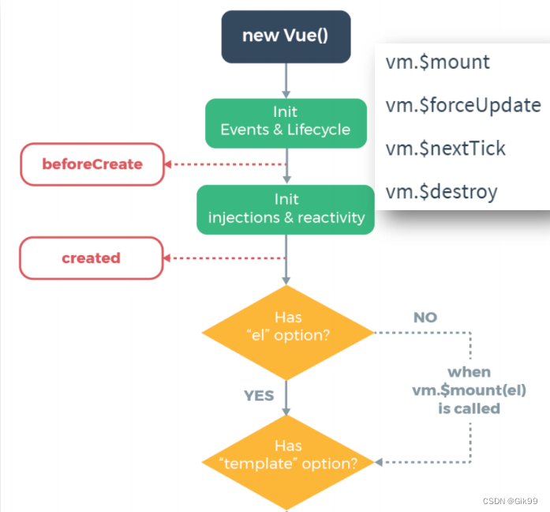
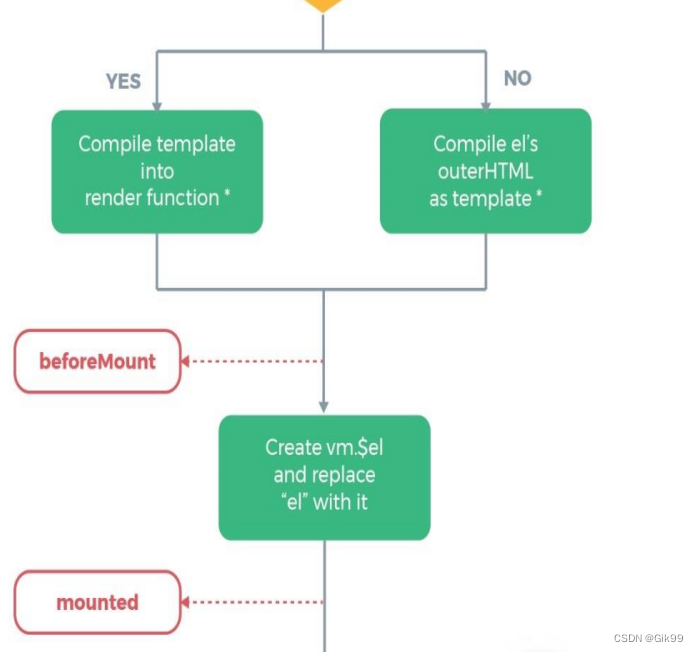
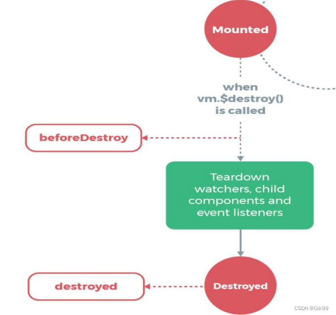

# Vue的生命周期

### Vue2

### 一、初始化阶段

1. new Vue() – Vue实例化(组件也是一个小的Vue实例)

2. Init Events & Lifecycle – 初始化事件和生命周期函数

3. beforeCreate – 生命周期钩子函数被执行(data和methods初始化之前)

4. Init injections&reactivity – Vue内部添加data和methods等

5. created – 生命周期钩子函数被执行, 实例创建(不能获取真实的DOM)

6. 接下来是编译模板阶段 –开始分析

7. Has el option? – 是否有el选项 – 检查要挂到哪里
   没有. 调用$mount()方法
   
   有, 继续检查template选项

### 二、 挂载阶段

1. template选项检查
   
   有 - 编译template返回render渲染函数
   
   无 – 编译el选项对应标签作为template(要渲染的模板)

2. 虚拟DOM挂载成真实DOM之前

3. beforeMount – 生命周期钩子函数被执行

4. Create … – 把虚拟DOM和渲染的数据一并挂到真实DOM上

5. 真实DOM挂载完毕

6. mounted – 生命周期钩子函数被执行

### 三、更新阶段

1. 当data里数据改变, 更新DOM之前
2. **beforeUpdate** – 生命周期钩子函数被执行
3. Virtual DOM…… – 虚拟DOM重新渲染, 打补丁到真实DOM
4. **updated** – 生命周期钩子函数被执行
5. 当有data数据改变 – 重复这个循环

### 四、 销毁阶段

1. 当$destroy()被调用 – 比如组件DOM被移除(例v-if)
2. **beforeDestroy** – 生命周期钩子函数被执行
3. 拆卸数据监视器、子组件和事件侦听器
4. 实例销毁后, 最后触发一个钩子函数
5. **destroyed** – 生命周期钩子函数被执行

### 五、 总结

| 常用钩子函数        |                                                                       |
|:-------------:| --------------------------------------------------------------------- |
| beforeCreate  | 在实例初始化之后，数据观测和事件配置之前被调用。此时data 和 methods 以及页面的DOM结构都没有初始化什么都做不了。      |
| created       | 在实例创建完成后被立即调用此时data 和 methods已经可以使用 但是页面还没有渲染出来。**（此时可以获取数据并存入data）** |
| beforeMount   | 在挂载开始之前被调用 此时页面上还看不到真实数据 只是一个模板页面而已。                                  |
| mounted       | el被新创建的vm.$el替换，并挂载到实例上去之后调用该钩子。数据已经真实渲染到页面上 在这个钩子函数里面我们可以使用一些第三方的插件。 |
| beforeUpdate  | 数据更新时调用，发生在虚拟DOM打补丁之前。页面上数据还是旧的。                                      |
| updated       | 由于数据更改导致的虚拟DOM重新渲染和打补丁，在这之后会调用该钩子。页面上数据已经替换成最新的。                      |
| beforeDestroy | 实例销毁之前调用。                                                             |
| destroyed     | 实例销毁后调用。                                                              |

### Vue3